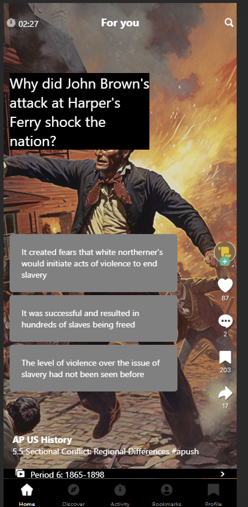
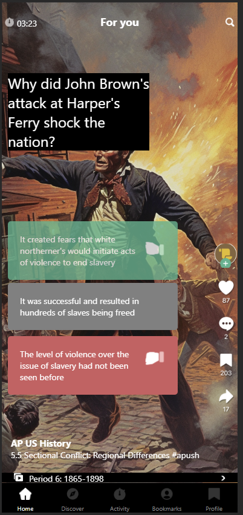

# Teachtok
At the heart of TeachTok's user experience is the "For You" section on the “Home” screen. This screen offers a seamless stream of fresh content at the fingertips of our users, encouraging continued exploration and engagement.

>primary focus of this project to evaluate is to evaluate cross-platform development framework to create applications according to a high-level specification, aligned to a provided high-fidelity design (colors, layout, margins, paddings, fonts), and following a Quality Bar.

In scope:
- Showing content for the  “For you” section of the “Home” screen,
- Displaying the Multiple Choice Questions (MCQs) in this section,
- Revealing the correct answer when the user taps one choice of an MCQ,
- Showing the content’s author name (e.g., “AP US History”), playlist, avatar, and content description,
- Browsing through content in an infinite scroll fashion (like TikTok),
- Measuring the time the user spent in the app using a countdown timer at the top left.

> created using using expo and react navigation

 

## Installation
 > - Clone repo.
 > - npm install
 > - npm run android  (to run on android)
 > - npm run ios (to run on ios emulator)
 > - npm run web (to run on web)

